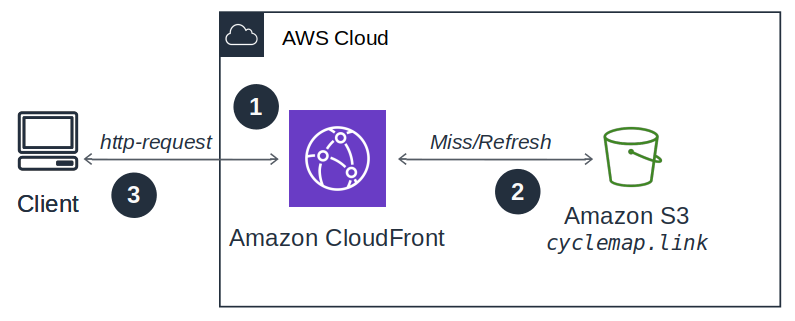

# aws-tileserver - Developer documentation
This page gives a detailled overview of all techiques used for this project.

## AWS-Architecture

### Creating the `postgis-client` Docker-image


1. User pushes new commit to Github
2. Github creates webhook for AWS CodeBuild
3. New Docker-Image is created and pushed to ECR

### Serving static Content



1. Client sends http-request to URL assigned to CloudFront Distribution.
2. CloudFront reads/caches static content from public S3 Bucket.
3. Http-response is sent to Client.

## Prerequisites

## Initial Setup

### AWS Credentials

- go to IAM and create a new user
- create an access key for that user
- run `aws configure` and enter the access keys incl. secret key as prompted.

## Lambda Implementation Details

### Vector Tiles

`aws-tileserver` supports configurable REST-endpoints for vector tiles according to [Vector Tile Specification 2.1](https://github.com/mapbox/vector-tile-spec/tree/master/2.1). Each endpoint provides access to a vectortile with configurable [layers](https://github.com/mapbox/vector-tile-spec/tree/master/2.1#41-layers).


### SQL-Query

Each layer is resolved to the following query:

```
(SELECT ST_AsMVT(q, '${layer.name}', ${layerExtend}, 'geom') as data FROM
    (SELECT ${prefix}ST_AsMvtGeom(
        ${geom},
        ${bbox},
        ${layerExtend},
        ${buffer},
        ${clip_geom}
        ) AS geom${keys}
    FROM ${layer.table} WHERE (${geom} && ${bbox})${where}${postfix}) as q)
```

All resulting layers are merged into one SQL query:

```
SELECT ( [${layer1} [|| ${layer2} [|| ...]] ) as data
```

## Next Steps

- Move database to [Serverless Aurora PostgreSQL](https://docs.aws.amazon.com/AmazonRDS/latest/AuroraUserGuide/aurora-serverless.how-it-works.html) to reduce monthly costs.
- Security-Review for Lambda-Code (e.g. SQL-Injection, ...)
- Change all scripts to use Postgres environment variables (PGUSER, ...)
- Omit Postgres credentials altogether and use IAM-role instead
- Add raster endpoint with node-mapbox-gl-native to serve pre-rendered raster-images.

## References

### AWS

- https://docs.aws.amazon.com/lambda/latest/dg/programming-model.html
- https://medium.com/@anjanava.biswas/nodejs-runtime-environment-with-aws-lambda-layers-f3914613e20e
- https://mikhail.io/serverless/coldstarts/aws/
- https://www.josephecombs.com/2018/03/05/how-to-make-an-AWS-S3-static-website-with-ssl
- https://medium.com/@adil/how-to-send-an-image-as-a-response-via-aws-lambda-and-api-gateway-3820f3d4b6c8
- http://erajasekar.com/posts/how-to-setup-subdomain-for-aws-api-gateway/
- https://stackoverflow.com/questions/17193647/difference-between-an-a-rec-and-cname-in-route53
- https://docs.aws.amazon.com/AmazonS3/latest/dev/how-to-page-redirect.html
- https://stackoverflow.com/questions/45773074/cloudfront-responds-with-403-forbidden-instead-of-triggering-lambda
- [CloudFront cache settings](https://aws.amazon.com/premiumsupport/knowledge-center/cloudfront-custom-object-caching)
- [Mocking aws-sdk with jest](https://github.com/aws/aws-sdk-js/issues/1963)

### JavaScript

- https://lucybain.com/blog/2018/js-es6-spread-operator/

### Typescript

- https://blog.atomist.com/typescript-imports/
- https://github.com/gotwarlost/istanbul/blob/master/ignoring-code-for-coverage.md

### Terraform

- https://learn.hashicorp.com/terraform/aws/lambda-api-gateway
- [How to manage Terraform state - A guide to file layout, isolation, and locking for Terraform projects](https://blog.gruntwork.io/how-to-manage-terraform-state-28f5697e68fa)

### Postgres

- https://node-postgres.com/

### Vectortiles

- https://docs.mapbox.com/vector-tiles/specification/
- https://github.com/mapbox/vector-tile-spec
